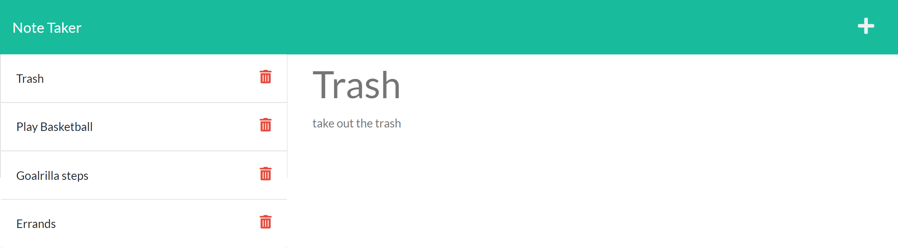

  # take-notes
  * 

  ## Description
  Take-notes is an application to write and keep notes for memory assistance purposes.  Everyone has things they want to remember and knows they won't keep all the details without writing them down.  Using a heroku application and express.js a server was created that displays a notes page.  On the notes page a user can add, review, and delete notes. 

  ## Table of Contents
  * [Installation](#installation)
  * [Usage](#usage)
  * [Deployed-Application-Link](#deployed-application-link)
  * [Deployed-Application-Screenshot](#deployed-application-screenshot)
  * [Credits](#credits)
  * [Contributing](#contributing)
  * [Questions](#questions)
  * [License](#license)

  
  ## Installation
  *  User needs to install Node.js
  *  User needs to clone the repo
  *  User needs to install express.js in the repo
  
  
  ## Usage
  A user can go the application link and then start adding notes.  If a user wants to delete a note they simply need click on the red trash icon.  If they want to add a note they need to click on the plus icon.  A note can only be added if the title and text section have data in them.
  
  
  ## Deployed-Application-Link
  
  [Deployed App](https://powerful-mountain-28877.herokuapp.com/)
  
  
  ## Deployed-Application-Screenshot
  
  
  
  
  ## Credits
   
  * Butler Bootcamp
  * GitHub: [coding-boot-camp](https://github.com/coding-boot-camp)
  * Front-end was provided by Butler Bootcamp.
  
  
  ## Contributing
  Clone the repo and make any tweaks the user thinks will be beneficial.  Reach out via info in Questions section to discuss those improvements.
  
  
  ## Questions
  GitHub: [J2021T](https://github.com/J2021T)

  EMAIL: [jordan.turcott@gmail.com](mailto:jordan.turcott@gmail.com)
  
  
  ## License
  This project is covered under the [MIT](../assets/license-files/MIT.txt) license.

 
  
  
